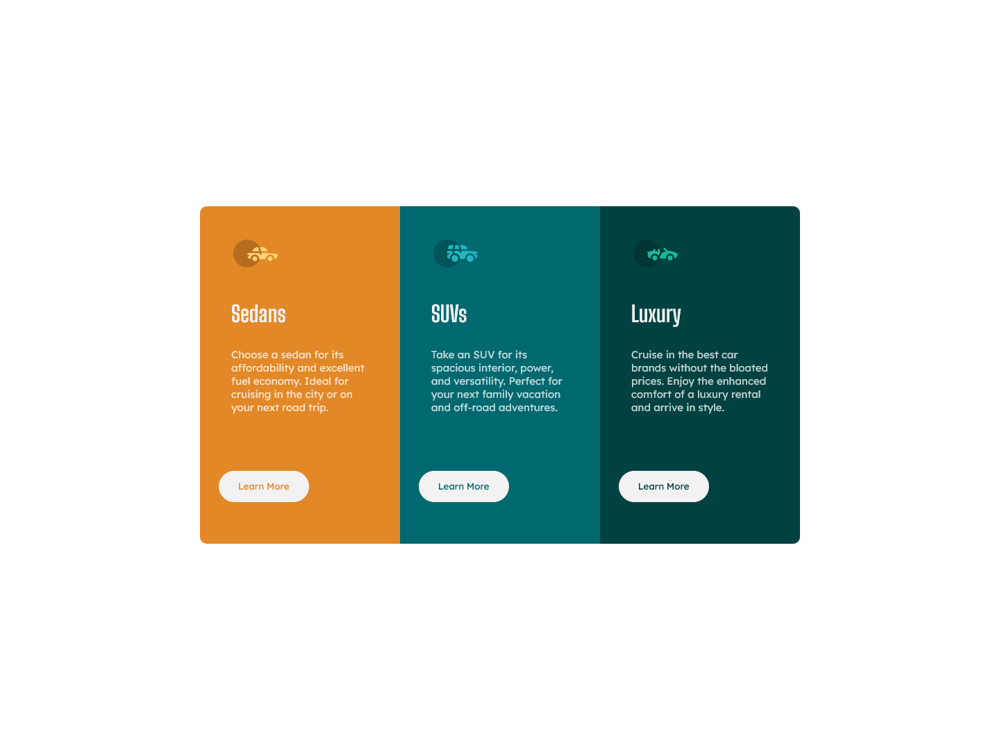

# Frontend Mentor - 3-column preview card component solution

This is a solution to the [3-column preview card component challenge on Frontend Mentor](https://www.frontendmentor.io/challenges/3column-preview-card-component-pH92eAR2-). Frontend Mentor challenges help you improve your coding skills by building realistic projects. 

## Table of contents

- [Overview](#overview)
  - [The challenge](#the-challenge)
  - [Screenshot](#screenshot)
  - [Links](#links)
  - [Built with](#built-with)
  - [What I learned](#what-i-learned)
- [Author](#author)

## Overview

### The challenge

Users should be able to:

- View the optimal layout depending on their device's screen size
- See hover states for interactive elements

### Screenshot

### Links

- Solution URL: 
- Live Site URL: 

## My process

### Built with

- Semantic HTML5 markup
- CSS custom properties
- Flexbox

### What I learned

This Challenge help me improve my HTML and CSS skills, and learn about the hover function on css.

## Author

- GitHub - [Marcelo Júnior](https://github.com/marcelo-jrs)
- Frontend Mentor - [@marcelo-jrs](https://www.frontendmentor.io/profile/marcelo-jrs)
- Twitter - [@marcelin_jrs](https://www.twitter.com/marcelin_jrs)
